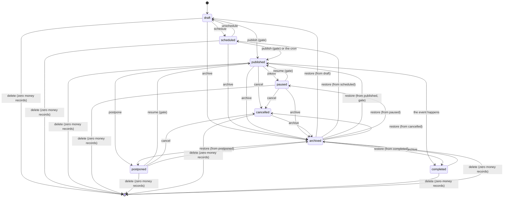

# The event lifecycle: every state, every transition, and where each one is enforced

Authority for what an event's `status` may be, how it may change, and what the database,
the interface and the public URL do at each step. Written 6 September 2026 for close-out
item C13, after the founder found on production that an organiser could not delete or
archive an event, and that a cancelled event could only ever be edited, viewed or
duplicated again.

The executable form of the transition table is `src/lib/event-lifecycle.ts`. The database
enforcement is migration `20260906000002_event_lifecycle_archive_delete.sql`. The guard that
holds this document and the code together is `scripts/guards/event-lifecycle-total.mjs`
(static) with `scripts/guards/event-lifecycle-installed.mjs` (the database this build runs
against). Where this document and the code disagree, the code is a defect and this document
wins until the code is repaired.

## The states

| Status | What it means | Public URL | On sale | In the organiser's default list |
|---|---|---|---|---|
| `draft` | Being written. Never published. | "not yet published" screen | no | yes |
| `scheduled` | Draft with a publish time set; the cron publishes it. | "not yet published" screen | no | yes |
| `published` | Live. Discoverable when `visibility = 'public'`. | full page | yes | yes |
| `paused` | Live but sales stopped by the organiser or an admin. | full page, ticketing suspended banner | no | yes |
| `postponed` | Live, new date pending. | full page, postponed banner | no | yes |
| `cancelled` | Not going ahead. Refunds run through the cancellation path. | full page, cancelled banner | no | yes |
| `completed` | The event has happened. | full page, past banner | no | yes |
| `archived` | Taken off every public surface and out of the default list by the organiser. Every record retained. | 404, except to a ticket holder | no | only under the Archived filter |
| deleted | The row is gone. A tombstone keeps the slug. | 410 Gone | no | no |

`archived` is a real `event_status` value (migration `20260906000001`). It is a status and
not a flag column on purpose: every public surface, every row-level security policy on
events, ticket tiers and add-ons, every cron and every share card route already filters on
`status = 'published'`, so a new value is excluded from all of them by construction, and
`scripts/guards/one-visibility-source.mjs` keeps the rule in one place. A flag column would
have needed every one of those twenty files edited, and any one missed would have kept
showing archived events.

Archived is orthogonal to cancelled. `events.archived_from_status` records the status the
event held when it was archived, so a cancelled event archives from cancelled and restores to
cancelled, a completed one to completed, a draft to draft. A CHECK constraint keeps the pair
honest: `status = 'archived'` if and only if `archived_at` is set.

Deleted is not a status. The row is removed, everything that references it follows the
foreign-key rules in the table below, and `event_tombstones` keeps the slug so the URL can
answer 410 rather than 404.

## The transitions

The same table, as the code holds it (`ALLOWED_TRANSITIONS` in `src/lib/event-lifecycle.ts`):

| From | May become | Notes |
|---|---|---|
| `draft` | `scheduled`, `published`, `archived` | publish runs the publish gate |
| `scheduled` | `published`, `draft`, `archived` | |
| `published` | `paused`, `postponed`, `cancelled`, `completed`, `archived` | |
| `paused` | `published`, `cancelled`, `archived` | resume runs the publish gate (cover) |
| `postponed` | `published`, `cancelled`, `archived` | |
| `cancelled` | `archived` | the dead end this item removes |
| `completed` | `archived` | the other dead end |
| `archived` | its `archived_from_status`, and nothing else | restore; to `published` it runs the publish gate |

Delete is a transition out of the table entirely and is legal from every status, subject to
the money rule below. Every status therefore has at least one way out: nothing is a dead
end, and `scripts/guards/event-lifecycle-total.mjs` fails the build if one returns.

Illegal, stated so nobody argues it later:

- `archived -> published` directly. An archived event is restored first, to the status it
  came from, and if that status is `published` the restore runs the same gate a publish
  runs (cover, sellable tiers, the organiser's payment posture). There is no side door to
  live.
- `archived -> archived`, `cancelled -> published`, `completed -> anything but archived`.
- Restoring to a status other than `archived_from_status`. Restore is exact.
- Archiving as a way out of a refund obligation. Archive is a discovery change and never a
  ticket change (below). An event that has sold tickets and is being taken down is
  cancelled, which runs the refund path; the interface says so on the archive control.
- Anything from deleted. The tombstone answers 410 for ever, unless a new event takes the
  slug, which the slug generator's random suffix makes vanishingly unlikely and which the
  proxy resolves in favour of the live event.

## Delete: eligibility, enforcement, and what it leaves behind

Delete is offered, and permitted, only when the event has NEVER had a payment record of any
kind. Free tickets count as tickets, exactly as Humanitix treats them. The records, each
enumerated from the schema (`C:\dev\EVIDENCE\C13\probe-fks-TEST-2026-09-06.txt` and
`probe-indirect-TEST-2026-09-06.txt`):

| Record | Where it lives | Path from the event |
|---|---|---|
| an order, in any status | `orders` | `orders.event_id` |
| an issued ticket, in any status | `tickets` | `tickets.event_id` |
| a paid squad member | `squad_members` | `squads.event_id`, member `paid_at` set or status `paid` |
| a discount code redemption | `discount_code_usages` | `discount_codes.event_id` |
| a refund request | `refund_requests` | `refund_requests.event_id` |
| a refund | `refunds` | `orders.event_id` |
| a payment | `payments` | `orders.event_id` (behind orders, listed for completeness) |

THE DATABASE ENFORCES IT, not the interface. `refuse_event_delete_with_money()` is a BEFORE
DELETE trigger on `events`. It counts the rows above and raises
`event has money records and cannot be deleted` naming each count. Triggers fire for every
role, including `service_role` and the admin console; there is no override. The interface
reads the same counts to decide whether to show Delete, and when it hides the control it says
why. The organiser types the event name to confirm, and the dialog says the delete is
permanent with no undo.

Row-level security decides WHO may delete: the organisation owner (`Org owners can delete
their events`, any status). Managers may archive, because archive is an update, but not
delete.

WHAT A DELETE LEAVES BEHIND: nothing. Every foreign key onto `events`, as it stands on TEST
after migration `20260906000002`:

| On delete | Tables |
|---|---|
| CASCADE | discount_codes (and through it discount_code_claims, discount_code_usages), event_addons, event_artists, event_stream_links, kit_poster_downloads, notifications, pricing_rules, refund_requests (and refund_request_tickets), reservations, saved_events, seat_holds, seats, squads (and squad_members), stream_messages, ticket_price_history, ticket_scans, ticket_tiers (and dynamic_pricing_rules, tier_access_codes, waitlist), ticket_transfers, tickets, virtual_queue, waitlist (and waitlist_notifications) |
| SET NULL | booking_requests, community_contributions, gigs, organiser_balance_ledger, organiser_marketing_consents, payout_holds, payouts, share_links (with `retired_at` stamped), venue_payouts, venue_share_ledger, events.parent_event_id (was NO ACTION; fixed) |
| RESTRICT | orders (and through orders: payments, refunds, community_contributions; through tickets: refund_tickets). These can never be reached, because the trigger refuses first, and they stay RESTRICT as the last line. |

The SET NULL rows are history that outlives the event on purpose: a payout that happened,
a share code that must never be reissued, a ledger line. None of them is an orphan; each is a
record whose subject is gone, and each says so with a null.

One of them could not, until this item. `share_links_target_exactly_one` (15 August 2026)
required exactly one of `event_id` and `destination_url`, while the retire trigger of
8 August nulls `event_id` and stamps `retired_at` on delete, so the SET NULL produced a row
with neither and Postgres refused the whole delete. Every event that had ever opened its
Launch Kit was undeletable, with a raw constraint message. The database proof found it on
its first run; the constraint now admits the retired state (`retired_at` set, both targets
null) and nothing else new.

Storage: the only per-event objects are in the `event-images` bucket under
`<creator>/<event id>/` (uploads) and `generated-covers/<event id>/` (composed covers). Both
prefixes are swept with pagination after the row is deleted, then listed again to prove they
are empty. Share cards, the OG image and the Launch Kit artefacts are rendered on request and
never stored, so there is nothing of theirs to remove. `kit-draft-covers` belongs to
pre-signup drafts, not events; `section-views` belongs to seat maps.

After a delete, `scripts/verify/event-lifecycle-proof.mjs` counts every referencing table
(enumerated live from `pg_constraint` through `event_referencing_tables()`) and both storage
prefixes, and passes only on zero.

## Archive: everywhere it takes effect

Archiving sets `status = 'archived'`, `archived_at`, `archived_from_status` and
`archived_by`. Because it is a status, these surfaces exclude it without a line of new code,
and the proof drives each one:

| Surface | How it excludes archived |
|---|---|
| browse, city browse, city and suburb pages, community and faith pages, categories, the homepage rails | `applyPublicEventVisibility` / `PUBLIC_EVENT_MATCH` (`status = 'published'`) |
| the personalised feed `/feed` | `fetchForYouFeed` composes the same rule |
| on-site search `/events?q=` | `fetchPublicEventsCached`, the same rule |
| the sitemap | `PUBLIC_EVENT_MATCH` in `src/app/sitemap.ts`, and `revalidateEventSurfaces` clears it at once |
| artist, venue and organiser public profiles | the same rule, `includeExternal` where they list rather than sell |
| the alert engine and push (`notify-just-announced`), the weekly digest | `.eq('status', 'published')` |
| the queue cron, the scheduled-publish cron | `published` and `scheduled` respectively |
| share card generation (`/api/og/event/[slug]`, `opengraph-image`) | non-published renders the brand fallback |
| anonymous reads through PostgREST | RLS on `events`, `ticket_tiers`, `event_addons`: `status = 'published'` |
| checkout | `create_reservation` and `create_seat_reservation` refuse any event not `published` ("This event is not on sale.") |

The last row is new in this migration and closes a gap that predates archiving: neither
function read `events.status`, so a paused or cancelled event could be reserved through the
server action while the page merely hid the panel.

The organiser still sees archived events under the Archived filter on `/dashboard/events`,
with Restore, Duplicate and (when eligible) Delete. The default list and every other tab
exclude them.

## Archive never breaks a real attendee

A ticket to an archived event is unchanged. `/tickets` lists it, `/t/[code]` opens it, the
door admits it:

- `/t/[code]` reads under the service role and does not consult `events.status`.
- `/tickets` reads under the holder's own session; the events join on that page is resolved
  with the service role for the holder's own tickets so an archived event's title and date
  still render.
- `scan_ticket`, `door_validation_set` and `sync_offline_scans` read `events` only for
  `organisation_id`. `scripts/guards/event-lifecycle-total.mjs` fails the build if an event
  status predicate ever appears in their effective definitions.
- The scanner page `/scan/[eventId]` authorises on the organisation, not the status.

The event page itself, for a holder: when the public read returns nothing, the page asks the
service role whether an archived event carries that slug and whether the signed-in viewer
holds a ticket for it (an order with their user id, or a ticket with their email). Only then
does it render, with an archived banner, no ticket panel and `noindex`. Everyone else gets a
real 404.

## Public URLs after the fact

| State | `/events/[slug]` | Sitemap | Share links `/e/[code]`, `/s/[code]` |
|---|---|---|---|
| archived | 404 (200 with a banner for a ticket holder, noindex) | removed | resolve to the event and therefore 404 for strangers |
| deleted | 410 Gone from the tombstone, branded page, `X-Robots-Tag: noindex` | removed | `share_links.event_id` is null, the resolver returns nothing, the designed not-found renders |

The 410 is produced by `src/proxy.ts`. The proxy already reads the event by slug for the
queue gate; only when that returns no row does it look in `event_tombstones`, so the hot path
costs the same one query it always did. Anonymous callers may read `slug` and `deleted_at`
from the tombstone table and nothing else (column privilege), so a deleted draft's title never
leaks through the REST surface.

THE EDGE CACHE, because it nearly undid the holder rule. `next.config.ts` caches
`/events/:slug` publicly at Vercel's edge for 300 seconds on the assumption that the render is
anonymous. An archived event's answer is per viewer, and measured on the pull request preview
the edge cached a stranger's 404 (`x-vercel-cache: HIT`) even with the proxy setting
`Vercel-CDN-Cache-Control: private, no-store` on the response: a header the proxy adds does not
reach the cache decision. So the rule is made on the request instead. The session middleware
sets a marker cookie, `el-signed-in`, on every response that has a user and clears it on every
response that does not; the public CDN header rule applies only when that cookie is MISSING
(`src/lib/auth/signed-in-marker.ts`); and the holder view renders only when it is PRESENT. A
signed-in viewer's responses are never shared at the edge, an anonymous viewer's 404 may be,
and a session that predates the marker gets one anonymous 404 (the response that sets it) and
then the page.

## Audit

Every archive, restore and delete writes one row to `audit_log`: who (actor id, email
snapshot, role snapshot `organiser` or the admin role), what (`event.archived`,
`event.restored`, `event.deleted`), when, from where (ip, user agent), and the event's state
at the time (status, `archived_from_status`, title, slug, the money counts for a delete). The
existing admin audit view lists the three actions. The writer is
`src/lib/events/lifecycle-audit.ts`; the admin console records through `recordAuditEvent`
with its session, as every other admin action does.

## The competitors, from their own pages (fetched 6 September 2026)

- Eventbrite: "If there are completed orders, you'll need to refund paid orders and cancel
  free orders first." and "you won't be able to delete your event until it has been
  completed in your account for 120 days or more."
  https://www.eventbrite.com/help/en-us/articles/172435/how-to-delete-an-event/
- Humanitix: "You cannot delete an event if you have sold any tickets at any point, even if
  those tickets have been cancelled or are free." and "Archived events are removed from your
  event listing view, all sales are stopped, and the event is marked as 'private'."
  https://help.humanitix.com/en/articles/8905615-how-do-i-delete-an-event
- TryBooking: events "can be closed, cancelled or archived but not deleted", "for audit
  purposes"; "You will be able to move Archived Events back to Past Events at any point in
  time." https://learn.trybooking.com/en/articles/41824-deleting-closing-and-archiving-events

EventLinqs takes Humanitix's delete rule (any ticket ever, free included, is a bar), offers
archive from every status as all three do, and restores exactly, as TryBooking does. It does
not adopt Eventbrite's 120 day wait, because a sold event here is never deletable at all.

## Out of scope, deliberately

Bulk delete or bulk archive. Single event actions only. Automatic archiving after a period
(TryBooking archives three years after the last session) is not built.
