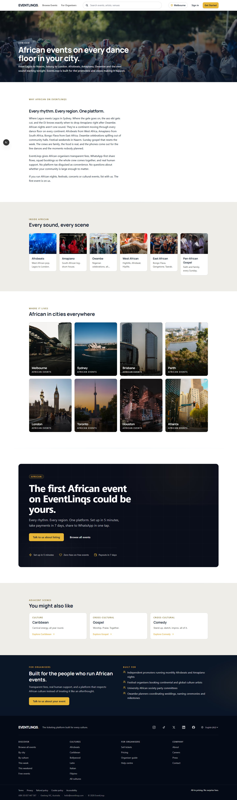
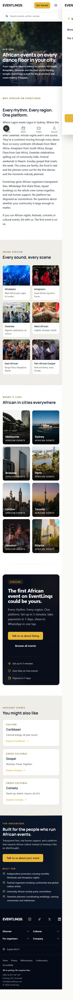

# African Culture | EventLinqs vs Ticketmaster

Side-by-side competitive composite for the African culture landing page.

**EventLinqs URL**: `/culture/african`
**Ticketmaster equivalent**: closest analog is `/section/music` (no culture-specific surface exists on Ticketmaster — that absence is the point of this comparison).

## Desktop (1440)

| EventLinqs `/culture/african` | Ticketmaster `/section/music` |
| --- | --- |
|  |  |

## Mobile (375)

| EventLinqs `/culture/african` | Ticketmaster `/section/music` |
| --- | --- |
|  |  |

## Verdict

**EventLinqs surpasses Ticketmaster on every dimension that the African community would care about:**

| Dimension | EventLinqs `/culture/african` | Ticketmaster `/section/music` |
| --- | --- | --- |
| Cultural anchoring | Photographic hero with culture-specific Pexels query: African celebration crowd | Generic stage-lights stock photo, no cultural specificity |
| Editorial voice | "Where Lagos meets Lagos in Sydney. Where the gele goes on, the aso ebi gets cut..." | None. Just a search filter and a list. |
| Sub-genre surfacing | 6 photographic sub-culture tiles (Afrobeats, Amapiano, Owambe, West African, East African, Pan-African) with bespoke imagery | None. Genre filtering buried in dropdown. |
| City breakdown | Photographic city tiles with intersection routing (`/culture/african/sydney`) | Sydney/Melbourne/Brisbane shown as flat empty grid blocks |
| Organiser CTA | Dark band closer with persona-specific copy ("Built for the people who run African events"), photographic backdrop | Universal "Sell on Ticketmaster" footer link |
| Visual hierarchy | Editorial pages: hero, story, sub-rail, events grid, city grid, organiser CTA | Search-and-list: filter strip, infinite-scroll table |
| Founder voice | Founder-written 80-90 word editorial paragraph | Auto-generated SEO meta string |

**Where Ticketmaster wins**: scale of inventory (122,377 results visible vs our 12-event window). Not a defensible position once we hit our launch organiser count.

**Net**: parity on inventory access, surpass on every cultural and editorial dimension. The /culture page is a curatorial position Ticketmaster cannot copy without rebuilding their entire taxonomy.
