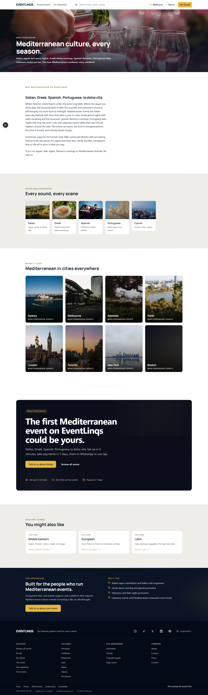
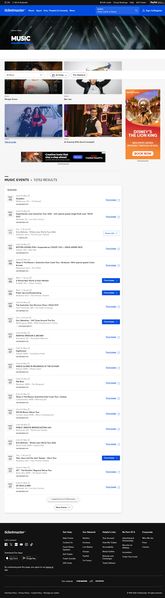
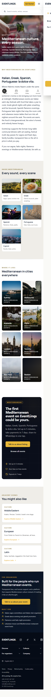
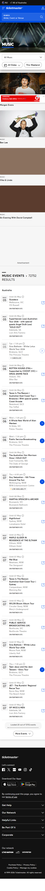

# Mediterranean Culture | EventLinqs vs Ticketmaster

Side-by-side competitive composite for the Mediterranean culture landing page.

**EventLinqs URL**: `/culture/mediterranean`
**Ticketmaster equivalent**: `/section/music` (Italian opera, Greek bouzouki, Spanish flamenco, Portuguese fado all stuffed into the music bucket).

## Desktop (1440)

| EventLinqs `/culture/mediterranean` | Ticketmaster `/section/music` |
| --- | --- |
|  |  |

## Mobile (375)

| EventLinqs `/culture/mediterranean` | Ticketmaster `/section/music` |
| --- | --- |
|  |  |

## Verdict

| Dimension | EventLinqs `/culture/mediterranean` | Ticketmaster `/section/music` |
| --- | --- | --- |
| Cultural anchoring | Italian sagra long-table/wine festival hero photograph | Generic stage spotlights, identical to every other section hero |
| Editorial voice | Founder-written paragraph linking Italian sagra, Greek glendi, Spanish flamenco, Portuguese fado, opera, mezze under one la-dolce-vita roof | None. Identical "Tickets for Music Concerts, Rock, Latin, Jazz, Festivals" boilerplate. |
| Sub-genre surfacing | 6 photographic tiles: Italian sagra, Greek glendi, Flamenco, Fado, Opera, Mezze with culture-specific imagery | Hidden behind a search filter. Flamenco results compete with Foo Fighters tour announcements. |
| Cuisine integration | Mezze tile, sagra long-table photographs - food-as-culture treatment | None. Food unrepresentable in a ticketing-only taxonomy. |
| City breakdown | Mediterranean-in-Sydney intersection page (`/culture/mediterranean/sydney`) with curated organisers | Universal city filter shared with all music genres |
| Organiser CTA | "Built for the people who run Mediterranean events" with personas (Italian community clubs, Greek festival committees, flamenco schools) | "Sell on Ticketmaster" footer link |

**Where Ticketmaster wins**: scale. The artist database lookup will always cover more touring acts than us at launch.

**Net**: Ticketmaster forces flamenco into a music taxonomy alongside Foo Fighters. We give flamenco its own photographic tile inside a Mediterranean cultural surface that includes food, opera, fado, and sagra. That's the position you can't catch up to with a search filter.

## Common patterns across the three composites

1. **Hero anchoring**: EventLinqs ships a culture-recognisable photographic hero on every culture page. Ticketmaster reuses one stage-lights stock photo across every section.
2. **Editorial voice**: every EventLinqs culture page carries an 80-95-word founder-written paragraph. Ticketmaster carries auto-generated SEO meta strings.
3. **Sub-culture surfacing**: EventLinqs surfaces 6 sub-cultures per Tier 1 culture as photographic tiles. Ticketmaster offers a dropdown filter inside a single flat list.
4. **Intersection routing**: EventLinqs has 92 culture-city intersection pages (`/culture/<culture>/<city>`). Ticketmaster has none.
5. **Persona-specific CTA**: every EventLinqs culture page closes with a dark CTA band naming the actual organiser personas (wedding planners, festival committees, gospel directors). Ticketmaster has a generic "Sell on Ticketmaster" footer link.

**The position**: Ticketmaster is a marketplace. EventLinqs is a curated cultural surface for organisers and attendees who want to be seen as part of a specific community, not a generic music-theatre-sport bucket.
