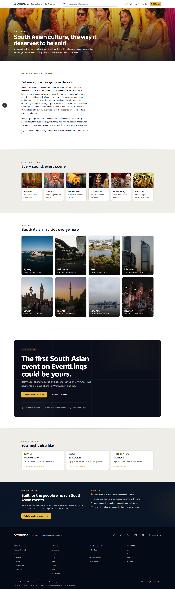
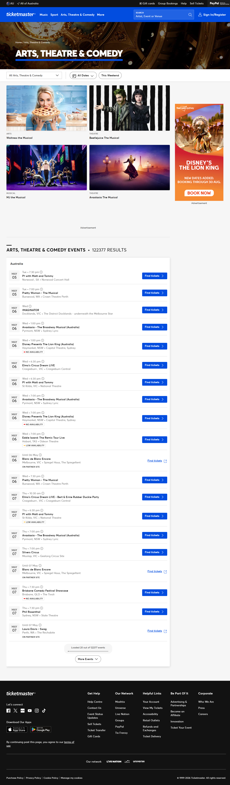
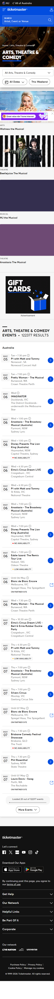

# South Asian Culture | EventLinqs vs Ticketmaster

Side-by-side competitive composite for the South Asian culture landing page.

**EventLinqs URL**: `/culture/south-asian`
**Ticketmaster equivalent**: `/section/arts-theatre-comedy` (Bollywood, classical dance, and Indian theatre fall here on Ticketmaster — there is no South-Asian-specific surface).

## Desktop (1440)

| EventLinqs `/culture/south-asian` | Ticketmaster `/section/arts-theatre-comedy` |
| --- | --- |
|  |  |

## Mobile (375)

| EventLinqs `/culture/south-asian` | Ticketmaster `/section/arts-theatre-comedy` |
| --- | --- |
|  |  |

## Verdict

| Dimension | EventLinqs `/culture/south-asian` | Ticketmaster `/section/arts-theatre-comedy` |
| --- | --- | --- |
| Cultural anchoring | Indian wedding sangeet hero photograph, culture-relevant Pexels query | Generic theatre crown moulding stock background |
| Editorial voice | Founder-written paragraph: South Asian breadth across Bollywood, Bhangra, Garba, Holi, Tamil, Classical | Tagline "Tickets for Arts, Theatre, Musical, Exhibit, Museum" - feature list, not voice |
| Sub-genre surfacing | 6 photographic tiles for Bollywood, Bhangra, Garba, Holi, Tamil, Classical with bespoke Pexels imagery and 1-line blurbs | None. Bollywood gets one event card if you scroll through 122k results |
| City breakdown | South Asian-in-Sydney, South Asian-in-Melbourne intersection pages with curated inventory | Universal city dropdown with no cultural filter |
| Organiser CTA | "Built for the people who run South Asian events" with persona pills (Wedding planners, Diwali festival committees, Bollywood DJs) | None |
| Image relevance | Sangeet/wedding/dance imagery, all hand-mapped Pexels queries | Murder Mystery, Anastasia musical, Beetlejuice - same set of generic Western theatre productions Ticketmaster pushes to every section |
| Mobile reflow | Stacked editorial cards with photographic anchors | Filter strip + infinite list |

**Where Ticketmaster wins**: 122,377 results in inventory. We win on every editorial dimension that matters to a South Asian organiser or attendee.

**Net**: South Asian organisers on Ticketmaster see Beetlejuice and Anastasia first; on EventLinqs they see Bollywood and Bhangra. The taxonomy bet is the position.
